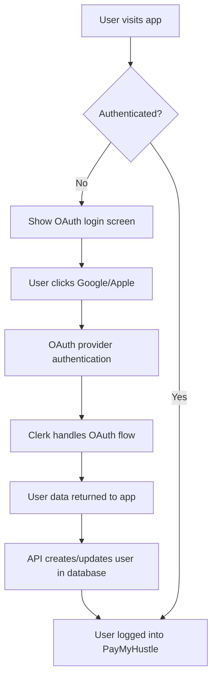

# 🔐 OAuth Setup Guide - Google & Apple Authentication

Your PayMyHustle app now supports **Google and Apple OAuth authentication**! Follow this guide to enable professional login with social accounts.

## 🚀 **Quick Setup Overview**

1. **Create Clerk Account** (free tier available)
2. **Configure OAuth Providers** (Google & Apple)
3. **Add Environment Variables**
4. **Test Authentication**

---

## 📋 **Step 1: Create Clerk Application**

### 1.1 Sign up for Clerk
1. Go to [https://dashboard.clerk.com](https://dashboard.clerk.com)
2. Sign up for a free account
3. Create a new application
4. Choose "React" as your framework

### 1.2 Get Your Keys
1. In your Clerk dashboard, go to **"API Keys"**
2. Copy your **"Publishable key"** (starts with `pk_test_`)
3. Copy your **"Secret key"** (starts with `sk_test_`)

---

## 🔧 **Step 2: Configure OAuth Providers**

### 2.1 Enable Google OAuth
1. In Clerk dashboard, go to **"User & Authentication" → "Social Connections"**
2. Click **"Configure"** next to Google
3. Toggle **"Enable Google"**
4. For development, Clerk provides default credentials
5. For production, you'll need your own Google OAuth app:
   - Go to [Google Cloud Console](https://console.cloud.google.com/)
   - Create/select a project
   - Enable Google+ API
   - Create OAuth 2.0 credentials
   - Add authorized redirect URIs from Clerk

### 2.2 Enable Apple OAuth
1. In Clerk dashboard, go to **"User & Authentication" → "Social Connections"**
2. Click **"Configure"** next to Apple
3. Toggle **"Enable Apple"**
4. For development, Clerk provides default credentials
5. For production, you'll need Apple Developer account:
   - Create App ID in Apple Developer Console
   - Generate Services ID
   - Create private key for Apple Sign In
   - Configure domains and redirect URLs

---

## 🔑 **Step 3: Environment Configuration**

### 3.1 Update .env.local
Replace the placeholder in your `.env.local` file:

```bash
# Replace with your actual Clerk publishable key
VITE_CLERK_PUBLISHABLE_KEY=pk_test_your_actual_key_here
```

### 3.2 For Production Deployment
When deploying to Cloudflare Pages, add these environment variables:

```bash
# In Cloudflare Pages dashboard → Settings → Environment Variables
VITE_CLERK_PUBLISHABLE_KEY=pk_live_your_production_key
CLERK_SECRET_KEY=sk_live_your_production_secret
```

---

## 🎨 **Step 4: Customize Authentication Experience**

### 4.1 Branding (Optional)
In Clerk dashboard → **"Customization" → "Appearance"**:
- Upload your logo
- Customize colors to match your brand
- Set custom sign-in/sign-up URLs

### 4.2 User Data Collection
In Clerk dashboard → **"User & Authentication" → "Email, Phone, Username"**:
- Choose required fields
- Enable/disable email verification
- Configure username requirements

---

## 🧪 **Step 5: Test Your Setup**

### 5.1 Build and Start Development Server
```bash
# Build the updated app
npm run build

# Start with OAuth enabled
wrangler pages dev dist --d1=DB=paymyhustle-db
```

### 5.2 Test Authentication Flow
1. Visit `http://localhost:8788`
2. You should see the new OAuth login screen
3. Try signing in with Google (works immediately with Clerk's dev setup)
4. Try signing in with Apple (may require production setup)
5. Verify user data is saved to your database

---

## 🎯 **What's New in Your App**

### ✅ **Professional Login Screen**
- Beautiful, responsive authentication UI
- Support for Google and Apple OAuth
- Automatic user account creation
- Session management across devices

### ✅ **Enhanced Security**
- Industry-standard OAuth 2.0 protocols
- Secure token management
- No password storage needed
- Automatic session refresh

### ✅ **User Experience**
- One-click social login
- Profile pictures from OAuth providers
- Automatic business name setup from OAuth data
- Cross-device synchronization

---

## 🔄 **Authentication Flow**



---

## 📱 **Mobile & Cross-Platform**

### iOS/Android Support
- Apple Sign In works natively on iOS devices
- Google Sign In works across all platforms
- Progressive Web App (PWA) support
- Touch ID/Face ID integration (when supported)

### Desktop Integration
- Works in all modern browsers
- Single Sign-On (SSO) capabilities
- Remember me functionality
- Secure logout across tabs

---

## 🐛 **Troubleshooting**

### Common Issues:

#### "Missing Clerk publishable key"
- Check your `.env.local` file exists
- Verify the key starts with `pk_test_`
- Restart your development server

#### "OAuth provider not configured"
- Ensure Google/Apple are enabled in Clerk dashboard
- Check development vs production settings
- Verify callback URLs are correct

#### "Database connection errors"
- User data might not sync if API is down
- Check that your D1 database is running
- Verify OAuth endpoint is working: `/api/auth/oauth/register`

### Debug Mode:
Add to your .env.local for additional logging:
```bash
VITE_CLERK_DEBUG=true
```

---

## 🚀 **Production Deployment Checklist**

### Before Going Live:
- [ ] Set up your own Google OAuth app
- [ ] Configure Apple Sign In (requires Apple Developer account)
- [ ] Add production Clerk keys to Cloudflare Pages
- [ ] Test OAuth flows in production environment
- [ ] Set up proper error monitoring
- [ ] Configure custom domains for OAuth redirects

### Security Best Practices:
- [ ] Enable email verification in Clerk
- [ ] Set up webhook for user events
- [ ] Configure rate limiting
- [ ] Review user data retention policies
- [ ] Set up monitoring and alerts

---

## 💡 **Next Steps**

1. **User Profiles**: Add profile management with OAuth data
2. **Team Features**: Multi-user company accounts
3. **SSO Integration**: Enterprise single sign-on
4. **Mobile App**: React Native with same OAuth setup
5. **Advanced Security**: Multi-factor authentication

---

**🎉 Congratulations!** Your PayMyHustle app now has professional OAuth authentication with Google and Apple. Users can sign in with their existing accounts for a seamless experience!